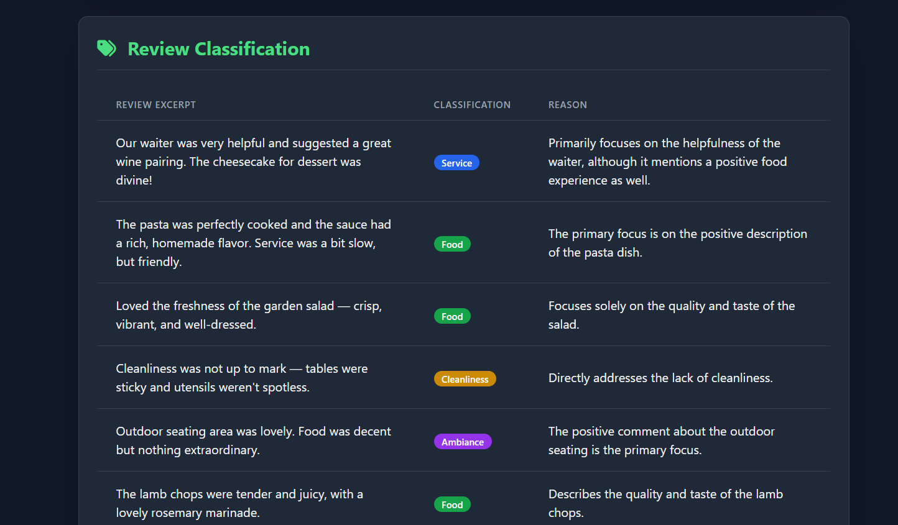
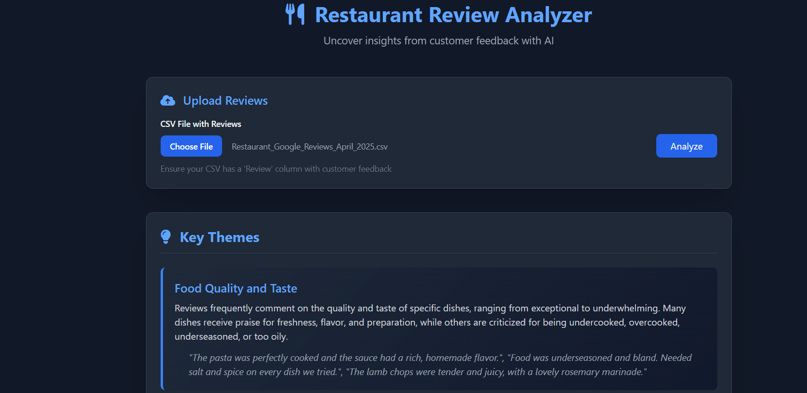
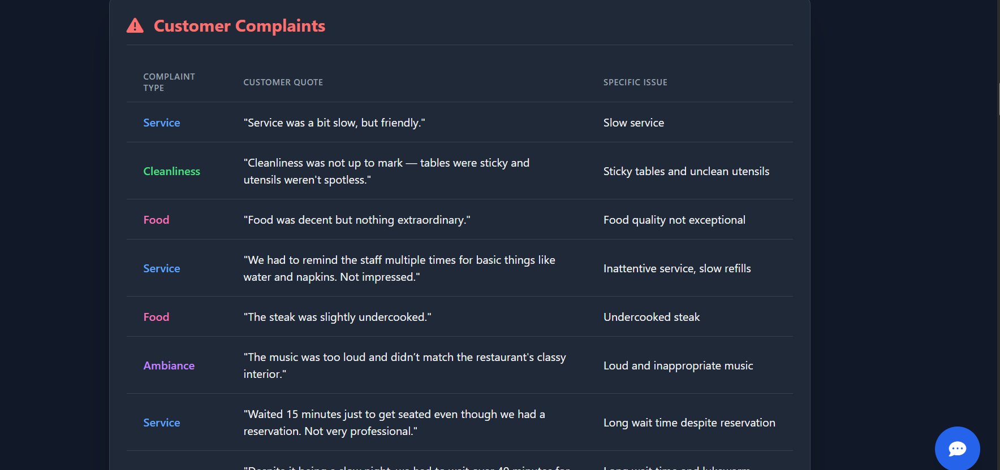
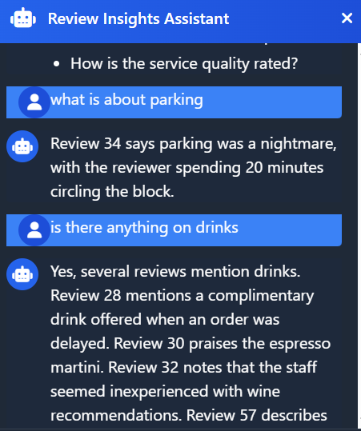

# Restaurant Review Analyzer

  
*Example of review classification output*

## Overview
A tool designed to analyze and extract insights from customer reviews using AI.

## Features
- **Review Upload**: Supports CSV files with a 'Review' column  
  
- **Key Themes Identification**: Highlights common themes
- **Complaint Tracking**:  
  
- **Interactive Q&A**:  
  

## Usage
1. Upload your reviews CSV
2. View automated analysis
3. Ask specific questions (e.g., "How is the service?")

## Limitations
- Only processes English text

